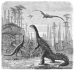

# PyTorch Steganography



Image adapted from https://en.wikipedia.org/wiki/Stegosaurus#/media/File:Dinosaurs_Sci_Am_1884.png.

## Example

```sh
python sender.py # Hides an image in a PyTorch model
python receiver.py # Compares modified model performance to original and extracts hidden data
```

## To-do

-   [ ] Encode length of data, eg using varint
-   [ ] Add encryption
